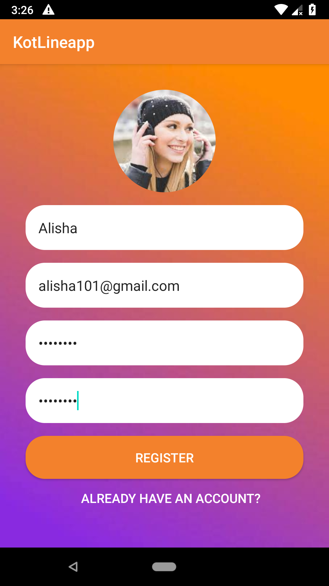
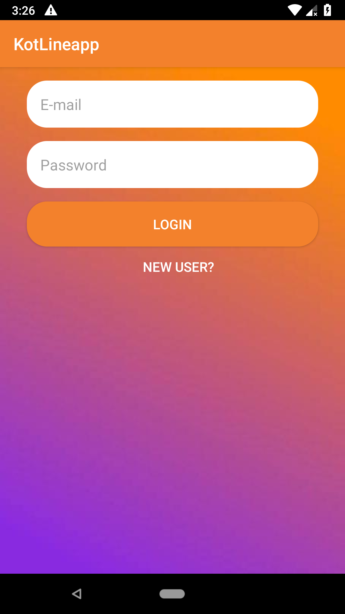
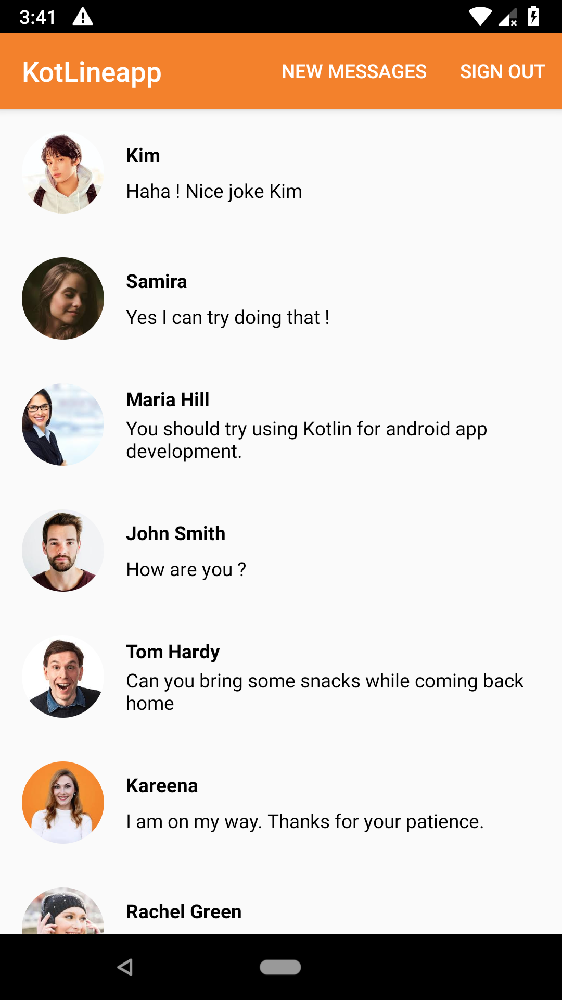
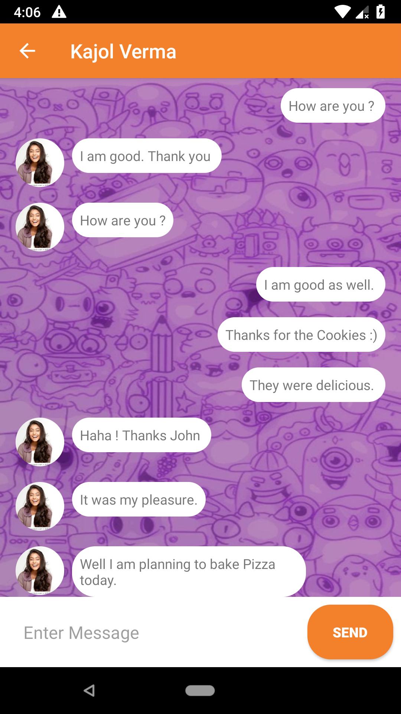

# KotLineapp
A chat messenger app for android built in **Kotlin** using **Android Studio** and **Firebase** for database.

### Features
*Register and Login
*Real-time Chat
*Latest messages
*New messages

### Screenshots

